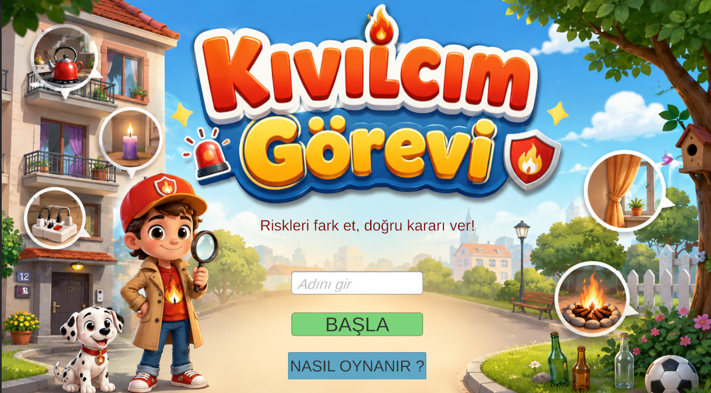
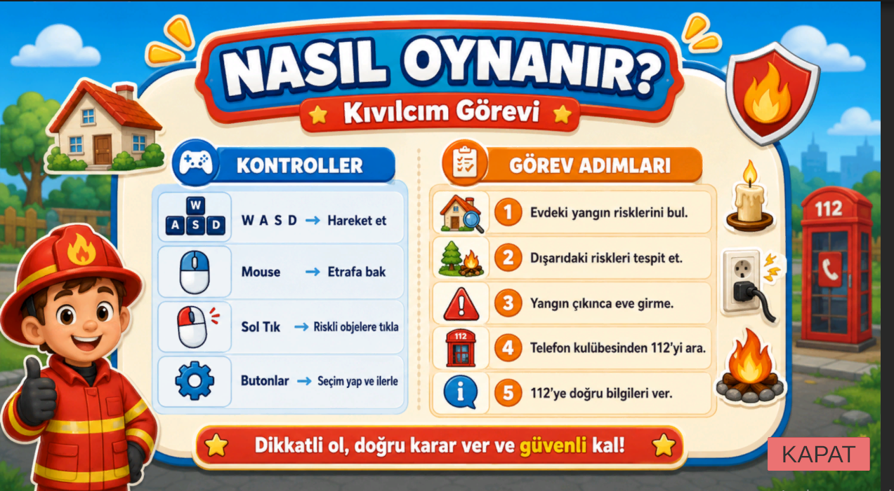
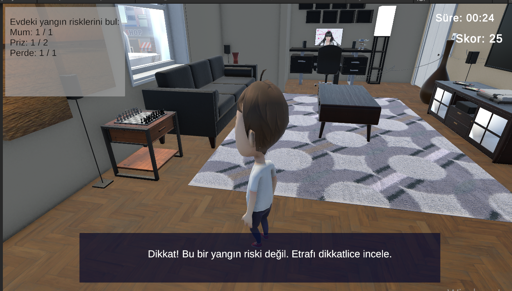
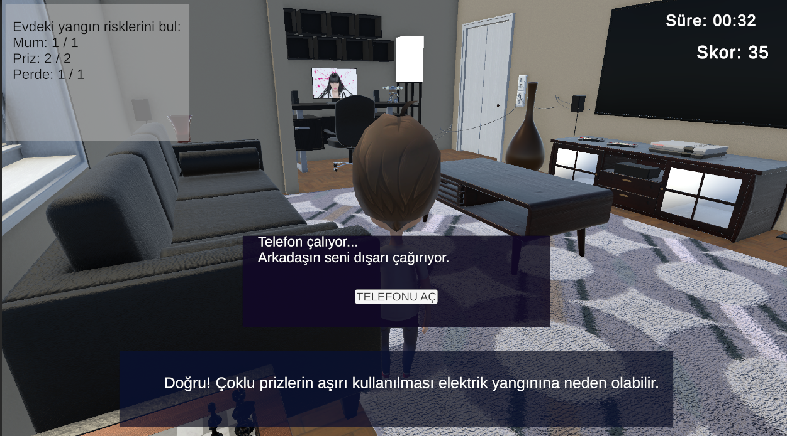
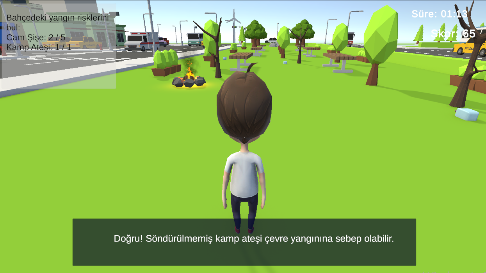
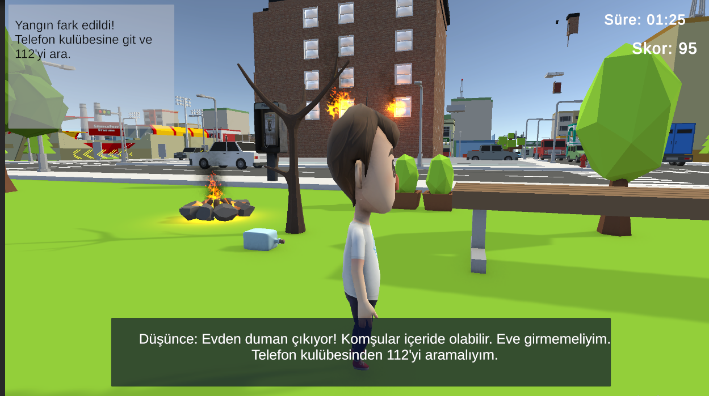
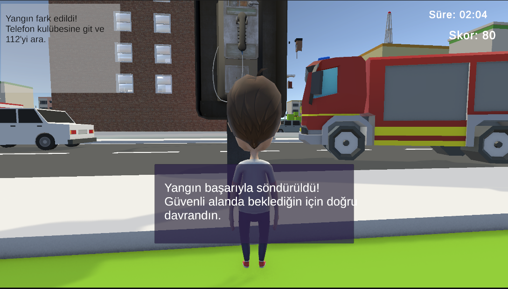
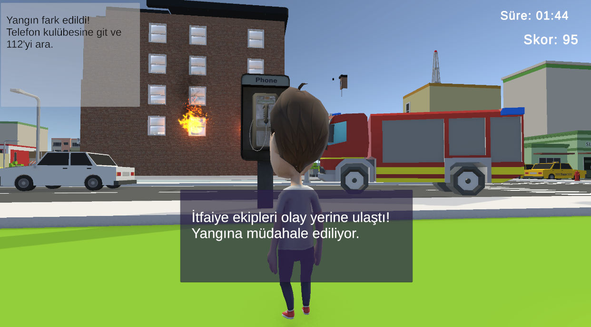
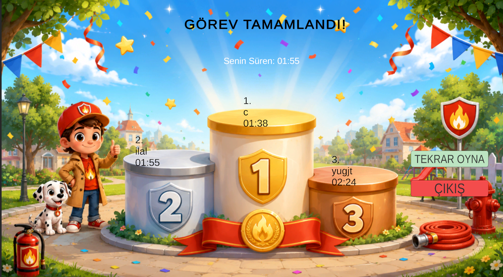

# OyunProjesi
 Yangın güvenliği temalı eğitici Unity oyunu
 https://youtu.be/g059SfhtzJM
# Kıvılcım Görevi

## Proje Hakkında

Kıvılcım Görevi, 10-12 yaş arası çocuklara yangın güvenliği bilinci kazandırmak amacıyla Unity ile geliştirilmiş eğitici bir oyundur. Oyunda oyuncu, evde ve dış ortamda yangına sebep olabilecek riskleri tespit eder. Yangın çıktığında eve girmemesi gerektiğini öğrenir ve telefon kulübesinden 112 Acil Çağrı Merkezi’ni arayarak doğru bilgileri vermeye çalışır.

## Proje Videosu

Oyunun tanıtım videosunu aşağıdaki bağlantıdan izleyebilirsiniz:

[YouTube Proje Videosu] https://youtu.be/g059SfhtzJM

## Oyunun Amacı

Bu oyunun amacı, çocuklara yangın risklerini fark etmeyi, tehlike anında doğru karar vermeyi ve acil durumda 112’yi aramayı öğretmektir. Oyuncu riskleri doğru tespit ettikçe puan kazanır. Yanlış nesnelere tıkladığında uyarı alır. Yangın çıktıktan sonra ise güvenli alanda kalması ve 112’ye doğru bilgileri vermesi beklenir.

## Oyun Akışı

Oyuncu önce 1.bölüm olan ev içerisindeki yangın risklerini bulur. Bu riskler mum, priz ve perde gibi yangına sebep olabilecek nesnelerdir. Daha sonra 2.bölüm dış alana geçerek cam şişe ve kamp ateşi gibi çevresel riskleri tespit eder. Tüm riskler bulunduğunda yangın senaryosu başlar.Yangın senaryosu ise 3.bölümümüzdür.Oyuncu nasıl davranacğını kendi seçer. Oyuncu eve girmek yerine telefon kulübesinden 112’yi arar ve adres, olay türü, yangının yeri ve içeride insan olup olmadığı gibi bilgileri doğru şekilde verir. Son aşamada itfaiye gelir ve yangına müdahale eder yangın söndürülür.

## Oyun İçi Görseller

### Başlangıç Ekranı

Oyuncunun oyuna başladığı ekrandır. Bu ekranda oyuna başlama ve nasıl oynanır bölümünü görüntüleme seçenekleri bulunur.

### Nasıl Oynanır Ekranı

Bu ekranda oyuncuya oyunun nasıl oynanacağı, hangi tuşların kullanılacağı ve görevlerin nasıl tamamlanacağı anlatılır.

### Ev Riskleri

Bu aşamada oyuncu ev içerisindeki yangın risklerini bulur. Mum, priz ve perde gibi nesneler yangına sebep olabilecek riskler olarak gösterilmiştir.

### Ev Riskleri ve Arkadaş Araması

Evdeki riskler bulunduktan sonra arkadaş araması gelir. Bu bölümden sonra oyuncu dış alana geçerek bahçedeki riskleri bulmaya başlar.

### Bahçe Riskleri

Bu aşamada oyuncu dış ortamda yangına sebep olabilecek cam şişe ve kamp ateşi gibi riskleri tespit eder.

### Düşünme Bulutu

Yangın fark edildiğinde oyuncuya düşünce yazısı gösterilir. Bu yazı oyuncuya eve girmemesi ve 112’yi araması gerektiğini hatırlatır.

### Yangın Söndürme

Oyuncu 112’ye doğru bilgileri verdikten sonra yangına müdahale edilir ve yangın söndürülür.

### İtfaiye Müdahalesi

Bu bölümde itfaiyenin olay yerine gelmesi ve yangına müdahale süreci gösterilir.

### Liderlik Tablosu

Oyun sonunda oyuncunun süresi ve skoru gösterilir. Liderlik tablosu ile oyuncuların başarı sıralaması görüntülenir.

## Kullanılan Teknolojiler

* Unity
* C#
* TextMeshPro
* 3D oyun ortamı
* UI panelleri
* Ses efektleri
* Skor ve süre sistemi

## Sonuç

Kıvılcım Görevi, çocuklara yangın güvenliği, 112 bilinci ve doğru acil durum davranışlarını oyun yoluyla öğretmeyi hedefleyen eğitici bir projedir.
